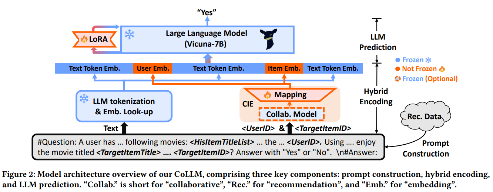

# CoLLM: Integrating Collaborative Embeddings into Large Language Models for Recommendation
[Yang Zhang](http://home.ustc.edu.cn/~zy2015), Fuli Feng, Jizhi Zhang, Keqin Bao, Qifan Wang and Xiangnan He. 

**University of Science and Technology of China**


**###### Update: Added the Qwen2-1.5B backbone; refer to files containing 'qwen' in their names and our revised paper.**


<a href='https://arxiv.org/abs/2310.19488'></a> 

**This repository is constructed based on [MiniGPT-4](https://github.com/Vision-CAIR/MiniGPT-4)!**


<!-- ## News
We now provide a pretrained MiniGPT-4 aligned with Vicuna-7B! The demo GPU memory consumption now can be as low as 12GB. -->


<!-- ## Online Demo

Click the image to chat with MiniGPT-4 around your images
[](https://minigpt-4.github.io)


## Examples
  |   |   |
:-------------------------:|:-------------------------:
 |  
  |  

More examples can be found in the [project page](https://minigpt-4.github.io). -->


## Introduction
We introduce CoLLM, a novel method that effectively integrates
collaborative information into LLMs by harnessing the capability
of external traditional models to capture the information. Similar to existing approaches (e.g., TALLRec), CoLLM starts by converting recommendation data into language prompts (prompt construction), which are then encoded and inputted into an LLM to generate recommendations (hybrid encoding and LLM prediction). We have  specific designs for incorporating collaborative information:

- When constructing prompts, we add user/item ID fields in addition to text descriptions to represent collaborative information.

- When encoding prompts, alongside the LLMs’ tokenization and
embedding for encoding textual information, we employ a conventional collaborative model to generate user/item representations that capture collaborative information, and map them into the token embedding space of the LLM, which are achieved by the CIE module in the figure.

For training, we take a two-step tuning method:

- Tuning the LoRA Module with the text-only input.

- Tuning the CIE module with both the text and user/item ID data.





## Getting Started
### Installation

**1. Prepare the code and the environment**

Git clone our repository, creating a python environment and ativate it via the following command

```bash
git clone https://github.com/zyang1580/CoLLM.git
cd CoLLM
conda env create -f environment.yml
conda activate minigpt4
```

***Code Structure:*** 
<!-- - **minigpt4**: Core code of CoLLM, following the structure of MiniGPT-4.
    - *models*: Defines our CoLLM model architecture.
    - *datasets*: Defines dataset classes.
    - *task*: A overall task class, defining the used model, training epoch, used datasets, and evaluation.
    - *runners*: A runner class to train and evaluate a model based on a task.
    - *common*: Commonly used functions.

- **dataset**: Dataset pre-processing.

- **prompt**: Used prompts.

- **train_configs**: Training configuration files, setting hyperparameters.

- **train_collm_xx.py**: Our CoLLM training file.

- **baseline_train_xx.py**: Baseline training file. -->


```
├──minigpt4: Core code of CoLLM, following the structure of MiniGPT-4.
    ├── models: Defines our CoLLM model architecture.
    ├── datasets: Defines dataset classes.
    ├── task: A overall task class, defining the used model and datasets, training epoch and evaluation.
    ├── runners: A runner class to train and evaluate a model based on a task.
    ├── common: Commonly used functions.
├──dataset: Dataset pre-processing.
├──prompt: Used prompts.
├──train_configs: Training configuration files, setting hyperparameters.
├──train_collm_xx.py CoLLM training file.
├──baseline_train_xx.py: Baseline training file.

```
Note: For the meaning of the parameters involved in train_configs, please read the comments of collm_pretrain_mf_ood.yaml. The parameters in other train_config files have the same meaning.

**2. Prepare the pretrained Vicuna weights**

The current version of CoLLM is built on the v0 versoin of Vicuna-7B.
Please refer to Mini-GPT4's instruction [here](PrepareVicuna.md) 
to prepare the Vicuna weights.
The final weights would be in a single folder in a structure similar to the following:

```
vicuna_weights
├── config.json
├── generation_config.json
├── pytorch_model.bin.index.json
├── pytorch_model-00001-of-00003.bin
...   
```

Then, set the path to the vicuna weight in the `"llama_model" ` field of a traing config file, e.g., [here](train_configs/collm_pretrain_mf_ood.yaml#L15)  for CoLLM-MF.

**3. Prepare the Datasets**

You can process the data yourself using the code provided in the ```./dataset``` directory. Alternatively, you can download our pre-processed data from [here](collm-datasets/).


### Training
The training of CoLLM contains two stages:

**1. LoRA Tuning**

To endow the cold-start recommendation capabilities of LLM, our initial focus is on fine-tuning the LoRA module to learn recommendation tasks independently of collaborative information. That is, we solely utilize the text-only segment of the prompt (e.g., "prompt_/tallrec_movie.txt") to generate predictions and minimize prediction errors for tuning the LoRA module to learning recommendation.

When implementing, you need to set the hyper-parameters in the training config file (e.g., [train_configs/collm_pretrain_mf_ood.yaml](train_configs/collm_pretrain_mf_ood.yaml)) as follows:
```
- freeze_rec: True # freeze the collaborative rec model
- freeze_proj: True  # freeze the mapping function or not
- freeze_lora: False # tuning the LoRA module
- prompt_path: "prompt_/tallrec_movie.txt" # use the prompt without the user/item IDs
- ckpt: None # without pretrained LoRA and CIE (LoRA), you can aslo directly delete this hypee-parameter 
- evaluate：False #set training
```

To launch the first stage training, run the following command. In our experiments, we use 2 A100. 
```bash
CUDA_VISIBLE_DEVICES=6,7 WORLD_SIZE=2 nohup torchrun --nproc-per-node 2 --master_port=11139 train_collm_mf_din.py  --cfg-path=train_configs/collm_pretrain_mf_ood.yaml > /log.out &
```


Our CoLLM checkpoint for this stage training can be downloaded at [here (7B)](https://rec.ustc.edu.cn/share/f7c20240-5fb1-11ef-acb4-298118b1826d). **Note that, the model obtained in this stage can be thought as a version of TALLRec.**


**2. CIE Tuning**

In this step, we tune the CIE module while keeping all other components frozen The objective of this tuning step is to enable the CIE module to learn how to extract and map collaborative information effectively for LLM usage in recommendations. To achieve this, we utilize prompts containing user/item IDs to generate predictions and tune the CIE model to minimize prediction errors. 
When implementing, you need set the hyper-parameters in the training config file as follows:

```
- freeze_rec: True # freeze the collaborative rec model
- freeze_proj: False  # tuning the mapping function or not
- freeze_lora: True # freeze the LoRA module
- pretrained_path: pretrained_collab_model_path # pretrained collab. model path 
- evaluate：False #set training
- prompt_path: "prompt_/collm_movie.txt" # use the prompt with the user/item IDs
- ckpt: step1_checkpoint_path # with pretrained LoRA
```
Then run the same command to the stage 1. Our final CoLLM checkpoint can be downloaded at [here (7B)](https://xxxxx). 

** Notes: By default, at this stage, we utilize a pretrained collaborative model and focus solely on tuning the mapping module (an MLP). Alternatively, you have the option to fine-tune both the complete CIE module (mapping + collaborative model), with or without prior pretraining of the collaborative model. This approach might yield enhanced performance, as outlined in Section 5.3.2 of our paper.  This can be achieved by controlling the above two hyper-parameters: *```freeze_rec```* and *```pretrained_path```*.


### Evaluation
Set the hyper-parameters in the training config file as follows:
```
- ckpt: your_checkpoint_path # trained model path
- evaluate: True # only evaluate
```
Then run the same command to the first stage training.


## Acknowledgement

+ [MiniGPT4](https://github.com/Vision-CAIR/MiniGPT-4) Our repository is built upon MiniGPT-4!
+ [Vicuna](https://github.com/lm-sys/FastChat) The fantastic language ability of Vicuna with only 13B parameters is just amazing. And it is open-source!


If you're using CoLLM code in your research or applications, please cite our paper using this BibTeX:
```bibtex
@article{zhang2023collm,
  title={CoLLM: Integrating Collaborative Embeddings into Large Language Models for Recommendation},
  author={Zhang, Yang and Feng, Fuli and Zhang, Jizhi and Bao, Keqin and Wang, Qifan and He, Xiangnan},
  journal={arXiv preprint arXiv:2310.19488},
  year={2023}
}
```


## License
This repository is under [BSD 3-Clause License](LICENSE.md).
Many codes are based on [MiniGPT-4]() with BSD 3-Clause License [here](LICENSE_minigpt4.md), which is build upon [Lavis](https://github.com/salesforce/LAVIS) with 
BSD 3-Clause License [here](LICENSE_Lavis.md).
